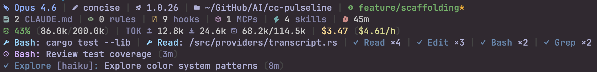
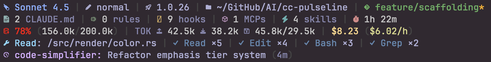
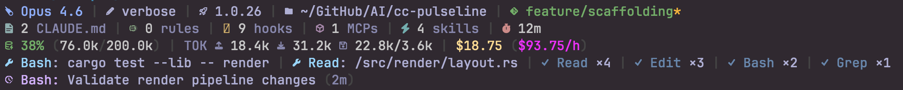
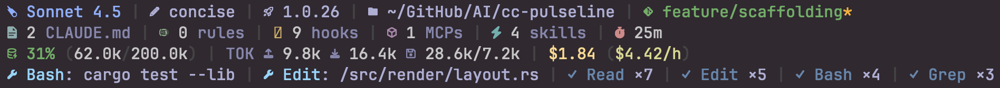
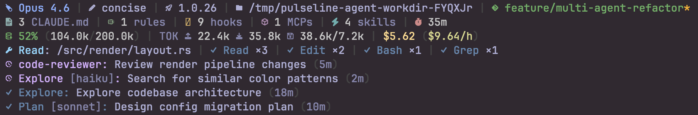
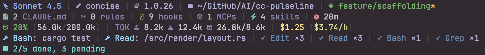

# cc-pulseline

[](https://github.com/GregoryHo/cc-pulseline/actions/workflows/ci.yml)
[](https://crates.io/crates/cc-pulseline)
[](https://www.npmjs.com/package/@cc-pulseline/cc-pulseline)
[](LICENSE)

A multi-line statusline for [Claude Code](https://docs.anthropic.com/en/docs/claude-code) that shows context usage, cost tracking, active tools, running agents, and todo progress — updated live as you work.



### What You'll See

**Core Metrics** — L1-L3 always visible

```
M:Opus 4.6 | S:explanatory | CC:2.1.37 | P:~/projects/myapp | G:main ↑2
1 CLAUDE.md | 3 rules | 2 hooks | 4 MCPs | 1 skills | 1h
CTX:43% (86.0k/200.0k) | TOK I: 10.0k O: 20.0k C:30.0k/40.0k | $3.50 ($3.50/h)
```

**Context Alert** — CTX ≥70% turns red



**Cost Alert** — Burn rate >$50/h turns magenta



**Tool Tracking** — Running tools + completed counts on L4



**Agent Tracking** — Running + completed agents on L5+



**Todo Tracking** — Task progress



## Features

- **4-line metrics dashboard** — Identity, config counts, budget, and live activity
- **Incremental transcript parsing** — Seek-based JSONL parsing with per-session offsets
- **Deep observability** — Active tools with targets, agent status, todo tracking
- **Session-aware** — Concurrent Claude Code sessions tracked independently
- **Adaptive rendering** — Width degradation for narrow terminals
- **Tokyo Night color palette** — 256-color ANSI with dark/light theme support
- **Minimal dependencies** — 3 runtime crates (serde, serde_json, toml)
- **Configurable** — TOML config with per-project overrides and segment toggles

## Quickstart

### 1. Install

```bash
# npm (recommended — works on macOS, Linux, Windows)
npm install -g @cc-pulseline/cc-pulseline

# From source
cargo install cc-pulseline

# Or clone and build
git clone https://github.com/GregoryHo/cc-pulseline.git
cd cc-pulseline && ./scripts/install.sh
```

### 2. Configure Claude Code

Add to `~/.claude/settings.json`:

```json
{
  "statusLine": {
    "type": "command",
    "command": "~/.claude/pulseline/cc-pulseline"
  }
}
```

### 3. Done

Start a Claude Code session — the statusline appears automatically.

## Installation Methods

| Method             | Command                               | Best For                |
| ------------------ | ------------------------------------- | ----------------------- |
| **npm**            | `npm i -g @cc-pulseline/cc-pulseline` | Claude Code users       |
| **cargo-binstall** | `cargo binstall cc-pulseline`         | Rust devs (prebuilt)    |
| **cargo install**  | `cargo install cc-pulseline`          | Rust devs (from source) |
| **install.sh**     | `./scripts/install.sh`                | Local clone             |

## Configuration

cc-pulseline uses TOML configuration with two scopes:

- **User**: `~/.claude/pulseline/config.toml`
- **Project**: `{project}/.claude/pulseline.toml` (overrides user)

```bash
cc-pulseline --init              # Create user config
cc-pulseline --init --project    # Create project config
cc-pulseline --check             # Validate configs
cc-pulseline --print             # Show effective merged config
```

### Example Config

```toml
[display]
theme = "dark"          # dark | light
icons = true            # nerd font icons vs ascii
tokyo_bg = false        # segmented background colors

[segments.identity]     # Line 1 — model, style, version, project, git
show_model = true
show_style = true
show_version = true
show_project = true
show_git = true

[segments.config]       # Line 2 — CLAUDE.md, rules, hooks, MCPs, skills, duration
show_claude_md = true
show_rules = true
show_hooks = true
show_mcp = true
show_skills = true
show_duration = true

[segments.budget]       # Line 3 — context, tokens, cost
show_context = true
show_tokens = true
show_cost = true

[segments.tools]
enabled = true
max_lines = 2           # max running tools shown
max_completed = 4       # max completed tool counts

[segments.agents]
enabled = true
max_lines = 2

[segments.todo]
enabled = true
max_lines = 2
```

## CLI Usage

```
cc-pulseline 1.0.0 - High-performance Claude Code statusline

USAGE:
    cc-pulseline [OPTIONS]
    echo '{"model":...}' | cc-pulseline

OPTIONS:
    -h, --help       Show this help message
    -V, --version    Show version
    --init           Create user config (~/.claude/pulseline/config.toml)
    --init --project Create project config (.claude/pulseline.toml)
    --check          Validate config files
    --print          Show effective merged config

RUNTIME:
    Reads Claude Code statusline JSON from stdin, outputs formatted lines.
    Empty stdin defaults to {}.

CONFIG FILES:
    User:    ~/.claude/pulseline/config.toml
    Project: {project}/.claude/pulseline.toml

ENVIRONMENT:
    NO_COLOR    Disable color output
    COLUMNS     Terminal width for layout degradation
```

## Environment Variables

| Variable   | Effect                                |
| ---------- | ------------------------------------- |
| `NO_COLOR` | Disable all color output              |
| `COLUMNS`  | Terminal width for layout degradation |

## Compatibility

### Requirements

| Requirement       | Minimum           |
| ----------------- | ----------------- |
| Terminal          | 256-color ANSI    |
| Rust (build)      | 1.74+             |
| Node.js (npm)     | 14+               |

### Platform Support

| Platform          | npm | cargo install | cargo-binstall |
| ----------------- | --- | ------------- | -------------- |
| macOS ARM64       | Yes | Yes           | Yes            |
| macOS x64         | Yes | Yes           | Yes            |
| Linux x64         | Yes | Yes           | Yes            |
| Linux x64 (musl)  | Yes | Yes           | Yes            |
| Linux ARM64       | Yes | Yes           | Yes            |
| Linux ARM64 (musl)| Yes | Yes           | Yes            |
| Windows x64       | Yes | Yes           | Yes            |

## Performance

Designed for repeated invocation by Claude Code's statusline hook:

| Scenario                             | Target (p95) |
| ------------------------------------ | ------------ |
| Baseline (no activity)               | < 10ms       |
| Active session (10 tools + 5 agents) | < 20ms       |
| Large transcript (2500 events)       | < 50ms       |

Benchmarks use [Criterion.rs](https://github.com/bheisler/criterion.rs). Run with:

```bash
cargo bench
```

See [docs/benchmarks.md](docs/benchmarks.md) for methodology and detailed results.

## Troubleshooting

**No color output?**
Check that the `NO_COLOR` environment variable is not set. Ensure your terminal supports 256-color ANSI. In tmux, verify `TERM` is set to `xterm-256color` or similar.

**Icons look broken?**
Set `icons = false` in your config file, or install a [Nerd Font](https://www.nerdfonts.com/).

**Statusline not appearing?**
Verify the `statusLine` entry in `~/.claude/settings.json` points to the correct binary path. Test directly with:

```bash
echo '{}' | cc-pulseline
```

**Config changes not taking effect?**
Run `cc-pulseline --check` to validate your config files and `cc-pulseline --print` to see the effective merged config.

## Documentation

| Guide                                          | Description                                                                            |
| ---------------------------------------------- | -------------------------------------------------------------------------------------- |
| [Architecture](docs/architecture.md)           | Pipeline design, module responsibilities, transcript three-path dispatcher             |
| [Metrics Reference](docs/metrics-reference.md) | Per-metric data sources, parsing methods, cache strategies, and output examples        |
| [Theme & Palette](docs/theme-palette.md)       | 256-color system specification, emphasis tiers, and color-annotated rendering examples |
| [Benchmarks](docs/benchmarks.md)               | Performance methodology and Criterion benchmark results                                |
| [Changelog](CHANGELOG.md)                      | Release history and version notes                                                      |

## Contributing

See [CONTRIBUTING.md](CONTRIBUTING.md) for development setup, testing, and pull request guidelines.

## Acknowledgements

cc-pulseline draws inspiration from these excellent projects:

- [claude-hud](https://github.com/jarrodwatts/claude-hud) — A Claude Code plugin showing context usage, active tools, running agents, and todo progress
- [CCometixLine](https://github.com/Haleclipse/CCometixLine) — Claude Code statusline tool written in Rust
- [cc-statusline](https://github.com/chongdashu/cc-statusline) — Informative statusline for Claude Code

## License

MIT License. See [LICENSE](LICENSE) for details.
