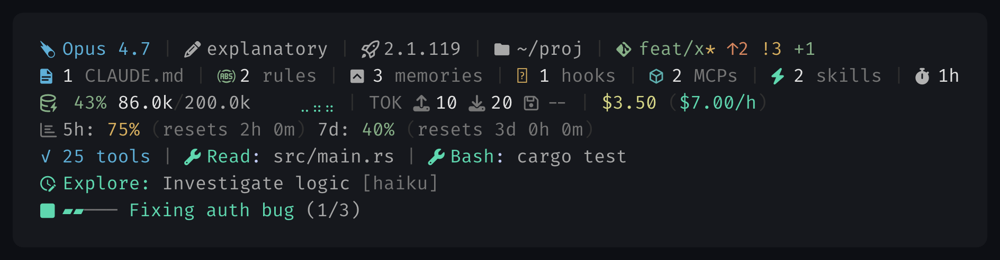
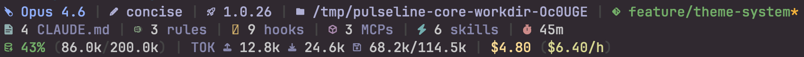
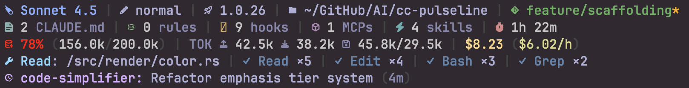
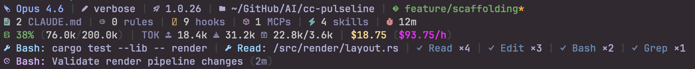
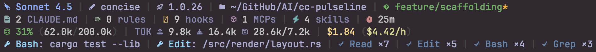
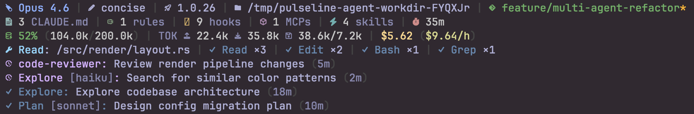
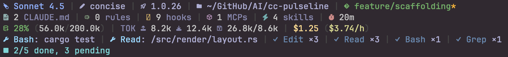

# cc-pulseline

[](https://github.com/GregoryHo/cc-pulseline/actions/workflows/ci.yml)
[](https://crates.io/crates/cc-pulseline)
[](https://www.npmjs.com/package/@cc-pulseline/cc-pulseline)
[](LICENSE)

A multi-line statusline for [Claude Code](https://docs.anthropic.com/en/docs/claude-code) that shows context usage, cost tracking, active tools, running agents, and todo progress — updated live as you work.



### What You'll See

**Core Metrics** — L1-L3 always visible



**Context Alert** — CTX ≥70% turns red



**Cost Alert** — Burn rate >$50/h turns magenta



**Tool Tracking** — Running tools with targets + completed counts (noise-filtered, multi-line wrapping)



**Agent Tracking** — Running + completed agents on L5+



**Todo Tracking** — Task progress



## Features

- **Multi-line metrics dashboard** — Identity, config counts, budget, quota, and live activity (layouts from flat to label-value `ledger` — see [docs/layouts.md](docs/layouts.md) for the catalog)
- **Incremental transcript parsing** — Seek-based JSONL parsing with per-session offsets
- **Deep observability** — Active tools with targets, agent status, todo tracking
- **Session-aware** — Concurrent Claude Code sessions tracked independently
- **Adaptive rendering** — Width degradation for narrow terminals
- **10 built-in themes** — ThemePalette system with custom themes, per-color TOML overrides, and `--preview`
- **Minimal dependencies** — 3 runtime crates (serde, serde_json, toml)
- **Configurable** — TOML config with per-project overrides and segment toggles

## Quickstart

### 1. Install

```bash
# npm (recommended — works on macOS, Linux, Windows)
npm install -g @cc-pulseline/cc-pulseline

# From source
cargo install cc-pulseline

# Or clone and build
git clone https://github.com/GregoryHo/cc-pulseline.git
cd cc-pulseline && ./scripts/install.sh
```

### 2. Configure Claude Code

Add to `~/.claude/settings.json`:

```json
{
  "statusLine": {
    "type": "command",
    "command": "~/.claude/pulseline/cc-pulseline"
  }
}
```

### 3. Done

Start a Claude Code session — the statusline appears automatically.

## Installation Methods

| Method             | Command                               | Best For                |
| ------------------ | ------------------------------------- | ----------------------- |
| **npm**            | `npm i -g @cc-pulseline/cc-pulseline` | Claude Code users       |
| **cargo-binstall** | `cargo binstall cc-pulseline`         | Rust devs (prebuilt)    |
| **cargo install**  | `cargo install cc-pulseline`          | Rust devs (from source) |
| **install.sh**     | `./scripts/install.sh`                | Local clone             |

## Configuration

cc-pulseline uses TOML configuration with two scopes:

- **User**: `~/.claude/pulseline/config.toml`
- **Project**: `{project}/.claude/pulseline.toml` (overrides user)

```bash
cc-pulseline --init              # Create user config
cc-pulseline --init --project    # Create project config
cc-pulseline --check             # Validate configs
cc-pulseline --print             # Show effective merged config
```

### Example Config

```toml
[display]
theme = "tokyo-night"   # tokyo-night | echo-sub-zero | titanium-precision | ...
# variant = "dark"      # dark | light (overrides theme default)
icons = true            # nerd font icons vs ascii

[segments.identity]     # Line 1 — model, style, version, project, git
show_model = true
show_style = true
show_version = true
show_project = true
show_git = true

[segments.config]       # Line 2 — CLAUDE.md, rules, memories, hooks, MCPs, skills, duration
enabled = true          # L2 row is opt-in (off by default)
show_claude_md = true
show_rules = true
show_memory = true
show_hooks = true
show_mcp = true
show_skills = true
show_duration = true

[segments.budget]       # Line 3 — context, tokens, cost
show_context = true
show_tokens = true
show_cost = true

[segments.tools]
enabled = true
max_lines = 2           # max running tools shown
max_completed = 4       # max completed tool counts
max_completed_lines = 1 # max rows of completed tools (overflow folds into a ` +N` tail)

[segments.agents]
enabled = true
max_lines = 2

[segments.todo]
enabled = true
max_lines = 2
```

### Layouts & Visual Composition

`[layout].name` picks how rows are arranged and decorated. Four layouts ship: `none` (flat default), `compact` (2–3 row micro layout), `console` (single outer frame + identity-in-frame-title, recommended ≥110 cols), and `ledger` (label-value pairs in a fixed-width TAG column with sparkline + delta-time on CTX).

Each layout asserts a tasteful default for the four widget-bearing segments. The user can override per segment via `*_visual` strings — same widget, any layout:

```toml
# Console layout, but with a CTX gauge added (default is text-only).
[layout]
name = "console"
[segments.budget]
context_visual = "gauge"

# Console without quota gauge — text quota only.
[layout]
name = "console"
[segments.quota]
visual = "text"
```

Recognized widgets: `gauge`, `sparkline`, `text` for context; `gauge`, `text` for quota. Combine with `+` (e.g. `"gauge+sparkline"`). Empty string defers to the layout default. Full reference: [`docs/layouts.md`](docs/layouts.md).

## CLI Usage

```bash
cc-pulseline                    # render statusline from stdin JSON (empty stdin = {})
cc-pulseline --init             # create user config (--init --project for project config)
cc-pulseline --check            # validate config files
cc-pulseline --print            # show effective merged config
cc-pulseline --preview          # preview themes (optional theme names)
cc-pulseline --preview-layouts  # preview every layout (optional widths)
cc-pulseline --select-theme     # interactively select and apply a theme (--project for project config)
cc-pulseline --palette-map      # show palette field → UI element mapping (optional theme)
```

Run `cc-pulseline --help` for the full option reference and the built-in theme list.

## Environment Variables

| Variable   | Effect                                |
| ---------- | ------------------------------------- |
| `NO_COLOR` | Disable all color output              |
| `COLUMNS`  | Terminal width for layout degradation |

## Compatibility

### Requirements

| Requirement       | Minimum           |
| ----------------- | ----------------- |
| Terminal          | 256-color ANSI    |
| Rust (build)      | 1.85+             |
| Node.js (npm)     | 14+               |

### Platform Support

| Platform          | npm | cargo install | cargo-binstall |
| ----------------- | --- | ------------- | -------------- |
| macOS ARM64       | Yes | Yes           | Yes            |
| macOS x64         | Yes | Yes           | Yes            |
| Linux x64         | Yes | Yes           | Yes            |
| Linux x64 (musl)  | Yes | Yes           | Yes            |
| Linux ARM64       | Yes | Yes           | Yes            |
| Linux ARM64 (musl)| Yes | Yes           | Yes            |
| Windows x64       | Yes | Yes           | Yes            |

## Performance

Designed for repeated invocation by Claude Code's statusline hook:

| Scenario                             | Target (p95) |
| ------------------------------------ | ------------ |
| Baseline (no activity)               | < 10ms       |
| Active session (10 tools + 5 agents) | < 20ms       |
| Large transcript (2500 events)       | < 50ms       |

Benchmarks use [Criterion.rs](https://github.com/bheisler/criterion.rs). Run with:

```bash
cargo bench
```

See [docs/benchmarks.md](docs/benchmarks.md) for methodology and detailed results.

## Troubleshooting

**No color output?**
Check that the `NO_COLOR` environment variable is not set. Ensure your terminal supports 256-color ANSI. In tmux, verify `TERM` is set to `xterm-256color` or similar.

**Icons look broken?**
Set `icons = false` in your config file, or install a [Nerd Font](https://www.nerdfonts.com/).

**Statusline not appearing?**
Verify the `statusLine` entry in `~/.claude/settings.json` points to the correct binary path. Test directly with:

```bash
echo '{}' | cc-pulseline
```

**Config changes not taking effect?**
Run `cc-pulseline --check` to validate your config files and `cc-pulseline --print` to see the effective merged config.

## Documentation

| Guide                                          | Description                                                                            |
| ---------------------------------------------- | -------------------------------------------------------------------------------------- |
| [Architecture](docs/architecture.md)           | Pipeline design, module responsibilities, transcript two-path event dispatcher         |
| [Metrics Reference](docs/metrics-reference.md) | Per-metric data sources, parsing methods, cache strategies, and output examples        |
| [Theme & Palette](docs/theme-palette.md)       | 256-color system specification, emphasis tiers, and color-annotated rendering examples |
| [Benchmarks](docs/benchmarks.md)               | Performance methodology and Criterion benchmark results                                |
| [Changelog](CHANGELOG.md)                      | Release history and version notes                                                      |

## Contributing

See [CONTRIBUTING.md](CONTRIBUTING.md) for development setup, testing, and pull request guidelines.

## Acknowledgements

cc-pulseline draws inspiration from these excellent projects:

- [claude-hud](https://github.com/jarrodwatts/claude-hud) — A Claude Code plugin showing context usage, active tools, running agents, and todo progress
- [CCometixLine](https://github.com/Haleclipse/CCometixLine) — Claude Code statusline tool written in Rust
- [cc-statusline](https://github.com/chongdashu/cc-statusline) — Informative statusline for Claude Code

## License

MIT License. See [LICENSE](LICENSE) for details.
